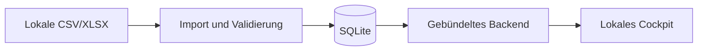

# Architektur

## Zweck

Dieses Dokument beschreibt die Architektur des Performance Cockpits ab Release 1.0.3. Die wesentlichen Technologieentscheidungen sind in den [Architecture Decision Records](adr/) dokumentiert.

## Architekturüberblick

Das System wird in klar getrennte Schichten gegliedert:

1. **Oberfläche** – Durch FastAPI serverseitig erzeugtes HTML für Kennzahlen und Formulare.
2. **Anwendung** – Python/FastAPI mit versionierter HTTP-API und Geschäftslogik.
3. **Datenverarbeitung** – validiert und importiert CSV-Messwerte im Backend.
4. **Persistenz** – SQLite in der Standalone-Anwendung; PostgreSQL optional für Entwicklung.
5. **Lokale Quellen** – CSV- und XLSX-Dateien werden ohne externe Verbindung verarbeitet.

## Komponenten

| Komponente | Verantwortung |
| --- | --- |
| FastAPI-Oberfläche | Serverseitiges HTML, Filter und Formulare ohne JavaScript-Build |
| FastAPI-Anwendung | API-Verträge, Validierung, Geschäftslogik und Datenzugriff |
| SQLite | Eingebettete lokale Speicherung ohne separaten Datenbankdienst |
| SQLAlchemy und Alembic | Datenmodell, Datenzugriff und versionierte Migrationen |
| PyInstaller | Bündelung der Python-Anwendung und Laufzeit als Windows-EXE |
| Docker Compose | Optionale reproduzierbare Entwicklungsumgebung |
| GitHub Actions | Linting, Tests, Containerprüfung und Windows-Standalone-Build |

## Konfiguration und Logging

- Backend-Konfiguration wird typisiert über `pydantic-settings` geladen.
- Backend-Variablen verwenden das Präfix `PERFORMANCE_COCKPIT_`.
- Browserseitig sichtbare Variablen verwenden das Präfix `VITE_`.
- Strukturierte JSON-Logs werden mit `structlog` erzeugt.
- Geheimnisse werden ausschließlich zur Laufzeit bereitgestellt.
- `.env.example` dokumentiert sichere Beispielwerte; `.env` wird ignoriert.

## Schnittstellenprinzipien

- HTML-Oberfläche und API verwenden dieselbe zentrale Python-Geschäftslogik.
- Die API beginnt unter `/api/v1` und wird bei inkompatiblen Änderungen versioniert.
- Pydantic-Modelle definieren und dokumentieren Request- und Response-Verträge.
- Eingehende Daten werden vor der Verarbeitung validiert.
- Personenbezogene Spalten des Performance-Reports werden vor der Persistenz verworfen.
- EPA ist die einzige individuelle Organisationseinheit; Potsdam wird im Import kumuliert.
- Kennzahlberechnungen erfolgen ausschließlich in der Python-Anwendung.
- Importfehler werden zeilen- und feldbezogen maschinenlesbar ausgegeben.

## Qualitätssicherung

| Bereich | Prüfungen |
| --- | --- |
| Backend | Ruff Linting, Ruff Formatcheck, pytest und Coverage-Schwelle |
| Oberfläche | pytest-Integrationstests für HTML, Formulare und Datenschutz |
| Integration | Docker-Compose-Konfiguration und Container-Build |

Die Continuous-Integration-Pipeline führt diese Prüfungen für Pull Requests und Änderungen an `main` aus.

## Sicherheits- und Datenschutzgrundsätze

- Geringstmögliche Berechtigungen für Dienste und Workflows
- Keine Secrets, Produktivdaten oder personenbezogenen Daten im Repository
- Nicht privilegierter Benutzer im Backend-Container
- Minimierte, versionierte API-Oberfläche
- Abhängigkeiten und Container werden regelmäßig aktualisiert

## Standalone-Betrieb

- Die Anwendung bindet nur an `127.0.0.1` und ist nicht aus dem Netzwerk erreichbar.
- Die HTML-Oberfläche wird direkt vom lokalen FastAPI-Prozess erzeugt.
- Die Oberfläche öffnet sich beim Start automatisch im Standardbrowser.
- Daten liegen unter `%LOCALAPPDATA%\PerformanceCockpit`.
- Zur Laufzeit werden keine externen Dienste oder Internetressourcen aufgerufen.
- Alembic-Migrationen aktualisieren bestehende lokale Datenbanken beim Start.
- Export, Backup, Wiederherstellung und Zurücksetzen laufen ausschließlich auf dem Gerät.
- Backups werden vor einer Wiederherstellung auf Integrität und Cockpit-Tabellen geprüft.
