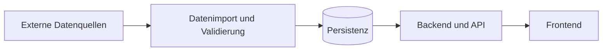

# Architektur

## Zweck

Dieses Dokument beschreibt das Architekturziel für das Performance Cockpit. Release 0.1 legt zunächst die Verantwortungsgrenzen und die Projektstruktur fest. Frameworks, Datenbanken und Betriebsplattformen werden erst nach Klärung der fachlichen und nichtfunktionalen Anforderungen verbindlich ausgewählt.

## Architekturüberblick

Das System wird in klar getrennte Schichten gegliedert:

1. **Frontend** – stellt Kennzahlen, Filter, Zeitverläufe und Statusinformationen dar.
2. **Backend** – bietet eine versionierte API, prüft Berechtigungen und enthält die Geschäftslogik.
3. **Datenverarbeitung** – importiert Quelldaten, validiert sie und berechnet standardisierte Kennzahlen.
4. **Persistenz** – speichert Konfigurationen, Kennzahlendefinitionen und aufbereitete Daten.
5. **Externe Quellen** – liefern Rohdaten über Dateien, Datenbanken oder APIs.

## Verzeichnisverantwortung

| Verzeichnis | Verantwortung |
| --- | --- |
| `frontend/` | UI-Komponenten, Visualisierung, clientseitiger Zustand und API-Anbindung |
| `backend/` | API-Endpunkte, Authentifizierung, Geschäftslogik und Datenzugriff |
| `data/` | Ausschließlich freigegebene Beispiel- oder Testdaten |
| `scripts/` | Import-, Entwicklungs-, Migrations- und Wartungsskripte |
| `docs/` | Architekturentscheidungen, Datenmodelle, Kennzahlendefinitionen und Betriebswissen |

## Zentrale Qualitätsziele

- **Nachvollziehbarkeit:** Jede Kennzahl besitzt Definition, Quelle, Berechnungslogik und Aktualisierungszeitpunkt.
- **Sicherheit:** Zugriffe folgen dem Prinzip der geringsten Rechte; Geheimnisse werden nur über sichere Konfiguration bereitgestellt.
- **Datenschutz:** Personenbezogene Daten werden minimiert, zweckgebunden verarbeitet und nicht im Repository gespeichert.
- **Wartbarkeit:** Komponenten haben eindeutige Verantwortlichkeiten und stabile Schnittstellen.
- **Testbarkeit:** Fachlogik wird vom Transport und von der Darstellung getrennt.
- **Beobachtbarkeit:** Fehler, Laufzeiten und Datenqualität können über Logs und Metriken nachvollzogen werden.

## Schnittstellenprinzipien

- Das Frontend greift ausschließlich über die Backend-API auf Daten zu.
- API-Verträge werden versioniert und dokumentiert.
- Eingehende Daten werden vor der Verarbeitung validiert.
- Kennzahlberechnungen erfolgen zentral im Backend beziehungsweise in der Datenverarbeitung, nicht parallel im Frontend.
- Fehlerantworten verwenden ein einheitliches, maschinenlesbares Format.

## Datenfluss

1. Ein Importprozess liest Daten aus einer freigegebenen Quelle.
2. Format, Vollständigkeit und Plausibilität werden geprüft.
3. Gültige Daten werden normalisiert und gespeichert.
4. Das Backend berechnet oder lädt die angeforderten Kennzahlen.
5. Das Frontend stellt Ergebnisse mit Filtern und Kontextinformationen dar.

## Offene Architekturentscheidungen

Vor Beginn der funktionalen Entwicklung sind mindestens folgende Entscheidungen als Architecture Decision Records zu dokumentieren:

- Frontend- und Backend-Technologie
- API-Stil und Versionierungsstrategie
- Persistenz- und Migrationskonzept
- Authentifizierung und Rollenmodell
- Importstrategie und Aktualisierungsintervalle
- Hosting, Deployment und Monitoring
