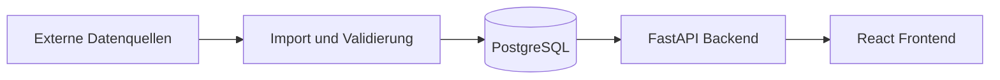

# Architektur

## Zweck

Dieses Dokument beschreibt die Architektur des Performance Cockpits ab Release 0.3. Die wesentlichen Technologieentscheidungen sind in den [Architecture Decision Records](adr/) dokumentiert.

## Architekturüberblick

Das System wird in klar getrennte Schichten gegliedert:

1. **Frontend** – React-Anwendung für Kennzahlen, Filter und Statusinformationen.
2. **Backend** – FastAPI-Anwendung mit versionierter HTTP-API und Geschäftslogik.
3. **Datenverarbeitung** – validiert und importiert CSV-Messwerte im Backend.
4. **Persistenz** – PostgreSQL für Konfigurationen, Kennzahlendefinitionen und aufbereitete Daten.
5. **Externe Quellen** – liefern Rohdaten künftig über Dateien, Datenbanken oder APIs.

## Komponenten

| Komponente | Verantwortung |
| --- | --- |
| React-Frontend | Darstellung, Navigation, Filterzustand und Aufruf der API |
| FastAPI-Backend | API-Verträge, Validierung, Geschäftslogik und Datenzugriff |
| PostgreSQL | Persistente Speicherung und konsistente Abfragen |
| SQLAlchemy und Alembic | Datenmodell, Datenzugriff und versionierte Migrationen |
| Docker Compose | Reproduzierbare lokale Laufzeitumgebung |
| GitHub Actions | Linting, Tests, Builds und Containerprüfung |

## Konfiguration und Logging

- Backend-Konfiguration wird typisiert über `pydantic-settings` geladen.
- Backend-Variablen verwenden das Präfix `PERFORMANCE_COCKPIT_`.
- Browserseitig sichtbare Variablen verwenden das Präfix `VITE_`.
- Strukturierte JSON-Logs werden mit `structlog` erzeugt.
- Geheimnisse werden ausschließlich zur Laufzeit bereitgestellt.
- `.env.example` dokumentiert sichere Beispielwerte; `.env` wird ignoriert.

## Schnittstellenprinzipien

- Das Frontend greift ausschließlich über die Backend-API auf Daten zu.
- Die API beginnt unter `/api/v1` und wird bei inkompatiblen Änderungen versioniert.
- Pydantic-Modelle definieren und dokumentieren Request- und Response-Verträge.
- Eingehende Daten werden vor der Verarbeitung validiert.
- Kennzahlberechnungen erfolgen zentral im Backend, nicht parallel im Frontend.
- Importfehler werden zeilen- und feldbezogen maschinenlesbar ausgegeben.

## Qualitätssicherung

| Bereich | Prüfungen |
| --- | --- |
| Backend | Ruff Linting, Ruff Formatcheck, pytest und Coverage-Schwelle |
| Frontend | ESLint, Prettier, TypeScript, Vitest und Produktions-Build |
| Integration | Docker-Compose-Konfiguration und Container-Build |

Die Continuous-Integration-Pipeline führt diese Prüfungen für Pull Requests und Änderungen an `main` aus.

## Sicherheits- und Datenschutzgrundsätze

- Geringstmögliche Berechtigungen für Dienste und Workflows
- Keine Secrets, Produktivdaten oder personenbezogenen Daten im Repository
- Nicht privilegierter Benutzer im Backend-Container
- Minimierte, versionierte API-Oberfläche
- Abhängigkeiten und Container werden regelmäßig aktualisiert

## Noch offene Architekturentscheidungen

- Authentifizierungsanbieter und detailliertes Rollenmodell
- Adapter und Aktualisierungsintervalle für produktive Datenquellen
- Hosting, Deployment, Monitoring und Backup
- Fehlerformat und Korrelations-IDs
- Datenaufbewahrung und Löschkonzept
