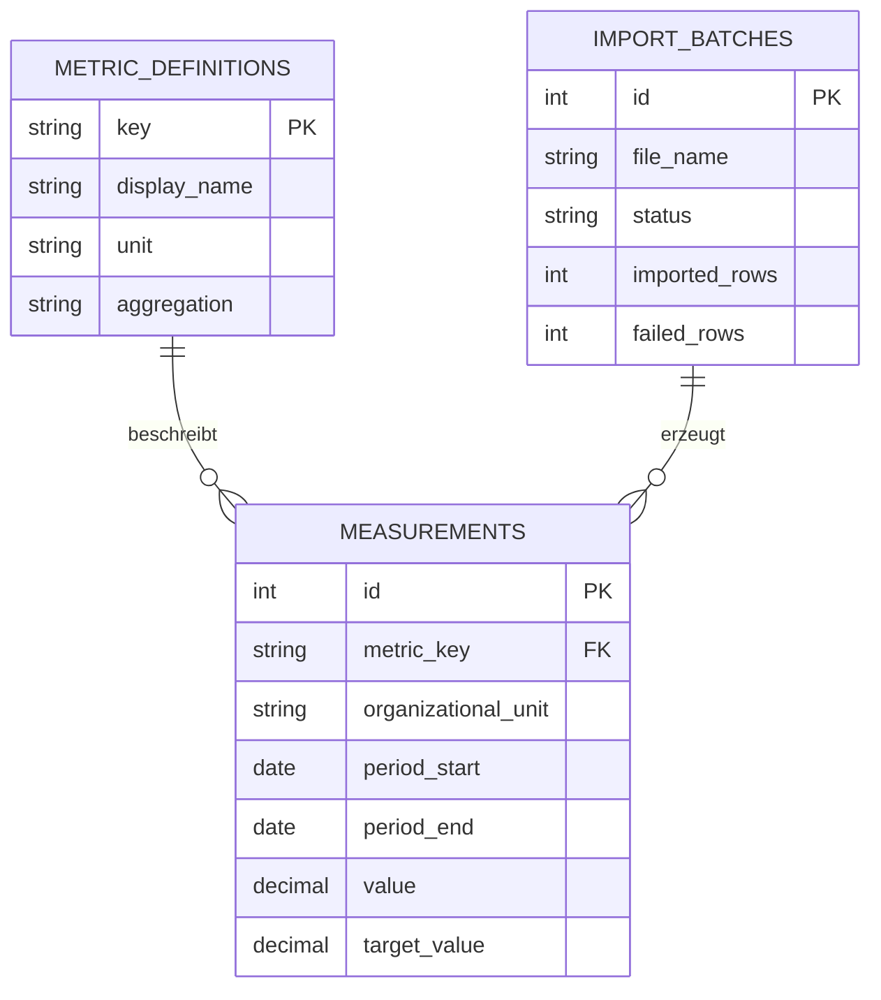

# Datenmodell

Release 0.3 führt ein relationales Datenmodell für Kennzahlen und periodische Messwerte ein.

## Kennzahlendefinition

Eine Kennzahl wird durch einen stabilen technischen Schlüssel identifiziert. Die Aggregationsart bestimmt, wie mehrere Messwerte in der Summary-API zusammengeführt werden:

- `sum`: Werte und Ziele werden addiert.
- `average`: Werte und vorhandene Ziele werden arithmetisch gemittelt.

## Messwert

Ein Messwert gehört zu genau einer Kennzahl, einer Organisationseinheit und einem Zeitraum. Die Kombination aus Kennzahl, Organisationseinheit, Start und Ende ist eindeutig. Ein erneuter Import aktualisiert deshalb vorhandene Werte, statt Duplikate anzulegen.

## Importprotokoll

Jeder CSV-Import erzeugt einen Import-Batch mit Status und Zeilenzahlen. Fehler werden zusätzlich in der API-Antwort zeilen- und feldbezogen ausgegeben.
